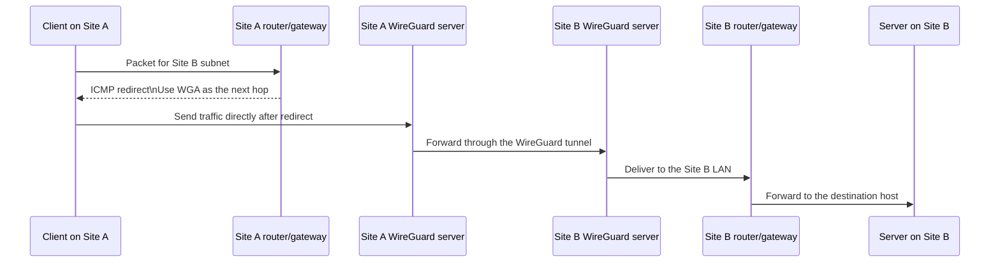

# ansible-role-wireguard

This Ansible role will install and configure WireGuard on the host, along with
the correct `nftables` and IP forwarding rules for the tunnels to work properly.

However, there are still a couple of manual steps required in order to have a
fully functional environment, like [preparing the network](#network-preparations)
and creating the [private and public keys](#key-generation) used in the
configurations. These will be referenced again in the text when necessary.


## Installation

This repository does not have any dependencies, so just move into your `roles/`
folder and run the following:

```bash
git clone git@github.com:JonasAlfredsson/ansible-role-wireguard.git wireguard
```

If you would like to download any updates for this role in the future, you may
use the following command from within the previously cloned folder:

```bash
git pull
```

When the configuration is complete you may then just include this role in your
main playbook like this:

```yaml
- hosts: site_hub
  name: Provision a Site Hub
  roles:
    - wireguard
```


## Usage

This section will take you through the different variables that exist, starting
with those that must be defined and then continuing with the optional ones used
for more advanced setups.

There are also some important [Network Preparations](#network-preparations)
steps which need to be completed in order for WireGuard to work properly, so
ensure that those are completed before continuing here.

### Host Preparations
For WireGuard to be able to shuttle traffic coming from a tunnel out to the
LAN we need to both enable `net.ipv4.ip_forward` and allow this traffic through
the firewall (`nftables`). This is managed by listing the physical interface
of the host where traffic may exit, like `eth0` or `enp0s31f6`, which should
be present and have an IP address when listed with the help of `ip addr` on the
targeted system. These should be defined in the following variable:

```yaml
wireguard_physical_interfaces: ["eth0"]
```

If you know what you are doing, and do not want any WireGuard traffic to be able
to reach the LAN, you can set this variable to `null` and you will not get an
error when trying to use this role.

### Simple Tunnel
The simplest and most common type of tunnel is the "road warrior" one, which is
where the clients (phones/laptops) just want to connect back to the LAN where
the server resides.

The `<wg0.key>` entry represents the server's private key, while the `<*.pub>`
entries represent the public keys of the clients. How to generate them is
explained in the [Key Generation](#key-generation) section.

```yaml
wireguard_tunnel_interfaces:
  wg0:
    private_key: "<wg0.key>"
    address: "10.13.13.1/24"  # Use a range that won't conflict with your LAN.
    listen_port: 51820
    peers:
      phone_1:
        public_key: "<phone1.pub>"
        allowed_ips: ["10.13.13.2/32"]  # The client MUST define the same address for its interface.
      laptop_1:
        public_key: "<laptop_1.pub>"
        allowed_ips: ["10.13.13.3/32"]  # No IP conflicts are allowed between the clients.
```

Adding more clients should be very simple, just make sure you don't have any
conflicting IP addresses.

In this setup all the traffic will be [masqueraded](#masquerade), and the
clients will not be able to initiate connections directly to each other. For a
more advanced setup you can go to the next section.

### Site-to-Site Tunnel
A more advanced setup is one where you want to make it seamless for clients on
one LAN to connect to clients on another LAN using their original IP addresses
directly. For this to work you will need two servers, one on each site, and
there are three approaches to setting this up (in recommended order):

1. Have a router powerful enough to run WireGuard and configure it there.
2. Set up a transit VLAN with a static route configured on the router.
3. Have the WireGuard server on the default LAN network and configure static
   routes on all the local clients.

I will go into a little more detail on the pros and cons of these cases, but
I will just hint at that the third option is subpar compared to the others.
The reason is how you must handle routing and firewall rules which become quite
complicated if you want to support all types of clients.

> Example [config for option 2](#example-site-to-site-config) at the very end
> of this section.

#### Case 1: Use the Router/Gateway
This will be the absolute easiest when it comes to routing, since most of the
routers will be able to add the correct rules by themselves and for all of the
clients they will just send all of their traffic to the default gateway and it
will end up at the correct destination.

The problem here is that WireGuard may become quite resource intensive, and a
weaker router will have trouble reaching >100 MBit/s speeds. Buying one with
active cooling will most likely mean that the CPU on it is powerful enough to
handle speeds greater than that.

If you are thinking about upgrading your networking hardware and want a
site-to-site tunnel you should probably splurge a little on this to make your
life easier.

#### Case 2: Transit VLAN
If you don't want to buy a new router you can just route the traffic to
something like a Raspberry Pi in order to offload the encryption and decryption
of the tunnel traffic. However, this method (with a "transit VLAN") requires you
to set up a separate VLAN in which you place this WireGuard server/gateway.

Using a separate VLAN allows all clients to remain unaware of any new routes,
and you can safely just add a static route on the router pointing the next hop
as being the WireGuard server. Having all traffic flow through the router
this way also means that its firewall will be aware of everything and not
drop traffic caused by [asymmetric routing](#icmp-redirect).

The cons with this solution is that all traffic will need to first be routed
from the LAN to the WireGuard server, and then routed again out to the internet.
This means that you are both limited by the "double" routing speed of the
router (which is usually fine) and that the total amount of traffic (sending +
receiving) cannot exceed the speed of the local wire.

For a little bit more advanced home setup you should probably be able to reach
~400 Mbit/s doing it like this via a Raspberry Pi. Which is faster than most
residential connections.

#### Case 3:
In this case the WireGuard server remains on the same VLAN as all the other
clients, which would mean that traffic can go directly to the server instead
of having to go through the router, meaning that basically you are just limited
by your internet connection.

However, I had a lot of trouble making this setup work reliably, and the
professional opinion is to use transit VLANs, but if you are able to use
either option 1 or 2 below you should be fine.

1. Announce static routes via DHCP option 121 (not supported by Android)
2. Set static routes manually on each client
3. Configure static routes on the router/gateway...
   1. ...without ICMP redirects (all traffic must go through the router)
   2. ...with ICMP redirects (will require "loose filtering" on the server)

Regarding option 3.1 it is only enterprise grade routers which will allow it,
and since this basically turns off the only benefit of this approach I would
not use this over a transit VLAN.

With option 3.2 you will run into issues regarding firewalls using "strict"
instead of "loose/sloppy" state tracking which will kill connections that do not
receive data along the same path on which it was sent. You will also have to
allow "[loose filtering](#icmp-redirect)" on the server's physical interfaces,
which in turn means that the following variable needs to be set on both sites:

```yaml
wireguard_loose_filtering_interfaces: ["eth0"]
```

This opens a security issue if your server is directly connected to the
internet, but is negligible if it is on a LAN since there are some much more
efficient attacks you can do instead of exploiting this.

Clients may also decide that they don't like asymmetric routing and drop
connections, or they may suddenly lose their routing cache during a big
transfer which results in it stalling. So yeah, not a good time going with
this option.


#### Example Site-to-Site Config
This is a sort of realistic configuration for [case 2](#case-2-transit-vlan)
where a transfer VLAN is used.
The base [network preparations](#network-preparations) are also expected to be
completed for both sites:

- **SITE A:**
  - Default VLAN: 192.168.10.0/24
  - Transit VLAN: 192.168.9.8/29
  - Server_A: 192.168.9.10
- **SITE B:**
  - Default VLAN: 192.168.20.0/24
  - Transit VLAN: 192.168.9.16/29
  - Server_B: 192.168.9.18

With this we now configure the servers to connect to each other and route the
other side's LAN subnet along with the IP of the WireGuard interfaces.

**Server A**
```yaml
# Allow traffic initiated FROM the physical interface to the site-to-site
# tunnel interface.
wireguard_forwarding_rules:
  eth0: ["site_B"]

wireguard_tunnel_interfaces:
  site_B:
    private_key: "<server_A.key>"
    address: "10.10.10.1/24"
    listen_port: 51820
    mtu: 1420           # Read about this in the "MTU" section.
    masquerade: false   # Read about this in the "masquerade" section.
    peers:
      serverB:
        public_key: "<server_B.pub>"
        preshared_key: "<site_AB.psk>" # Read about this in the "Pre-Shared Keys" section.
        allowed_ips: ["10.10.10.2/32", "192.168.20.0/24"] # Site B's subnet.
        endpoint: site_b.com:51820
```

**Server B**
```yaml
wireguard_forwarding_rules:
  eth0: ["site_A"]  # Notice the interface name differences.

wireguard_tunnel_interfaces:
  site_A:
    private_key: "<server_B.key>"
    address: "10.10.10.2/24"
    listen_port: 51820
    mtu: 1420
    masquerade: false
    peers:
      serverA:
        public_key: "<server_A.pub>"
        preshared_key: "<site_AB.psk>"
        allowed_ips: ["10.10.10.1/32", "192.168.10.0/24"] # Site A's subnet.
        endpoint: site_a.com:51820
```

The final step is to go to each site's router/gateway and define the following
static routes:

**SITE A**:
- Destination: 192.168.20.0/24
- Default Gateway: 192.168.9.10

**SITE B**:
- Destination: 192.168.10.0/24
- Default Gateway: 192.168.9.18

You should now be able to ping a computer on site B (192.168.20.123) from site
A (192.168.10.213).


## Useful Information

This section contains useful commands, tips, and more detailed explanations for
topics mentioned earlier in the guide.

### Key Generation
When creating tunnels and connecting clients you will need a private/public
key pair in order to both encrypt and authenticate the traffic. The private part
is the most important part that may not be known by anyone else than the one
that created it.

You as the owner of the server (deployed through this role) should really only
need to know about the private key defined for the
[receiving interface](#simple-tunnel). Any peers should hand you their public
key, and any pre-shared key if one is used, for inclusion in this role.

#### Create Server Keys
The quick and easy method to creating, and saving, the keys for an interface is
the following:

```bash
sudo -i
cd /etc/wireguard
umask 077
wg genkey | tee wg0.key | wg pubkey > wg0.pub
```

where the `wg0` should match the interface name.

The initial commands are there to make sure the files are created with
restrictive permissions inside the same folder as the other sensitive
configuration files.

#### Create Client Keys
This is basically the same command as [above](#create-server-keys), but here we
just output the content to stdout and do not save it anywhere.

This is often the smarter way to create client key pairs, since the client can
put the private key directly into its own config and only send over the public
key for us to include here.

```yaml
wg genkey | tee /dev/tty | wg pubkey
```

### Pre-Shared Keys
WireGuard can optionally add a pre-shared symmetric key on top of its normal
public-key cryptography. This is not required for WireGuard to be secure today,
but it adds another layer of protection that makes it more resistant to
quantum computers.

The pre-shared key must be the same on both sides of a single peer
relationship. It is configured per peer, not per interface, so each peer entry
may have its own `preshared_key` value.

To generate one, use:

```bash
wg genpsk
```

### MTU
Maximum Transmission Unit is the largest packet size an interface can send
without fragmentation. WireGuard adds encapsulation overhead to every packet, so
the effective MTU on the tunnel is often a little lower than the MTU on the
physical interface. The exact overhead depends on the outer path and transport,
and when no MTU is configured explicitly `wg-quick` usually chooses a sensible
value automatically. On a typical 1500-byte underlay this is often `1420`.

You only need to change it when traffic through the tunnel shows signs of
fragmentation problems, such as some sites loading while others stall or large
packets silently disappearing.

Common starting points are:

- `1420`: A common default for a 1500-byte underlay.
- `1400`: A conservative choice when extra overhead is expected.
- `1360`: Often used when the path includes PPPoE or similar overhead.
- `1280`: The minimum IPv6 link MTU, useful as a lower bound.

### Masquerade
By default this role configures masquerading on the WireGuard interfaces, which
means that hosts beyond the WireGuard server will see the server's tunnel or
egress address as the source, rather than the original address of the
connecting client.

This keeps routing simple, since no extra routes are needed for returning
traffic to the clients behind the tunnel. However, devices on the LAN no longer
see a directly routable client address. They only see the WireGuard server as
the source, which means they cannot **initiate** a direct connection back to a
specific client through the tunnel.

That is usually fine for road-warrior clients. For a site-to-site tunnel, where
each side needs to route traffic to the other subnet directly, you can disable
masquerading for that interface. This then leaves the original source intact,
which means it is possible to know which host on the other side of the tunnel
the traffic came from. Some kind of static routing will need to be configured
for the traffic to know where to go except for the current default gateway.

### ICMP Redirect
An ICMP redirect is a message a router can send to a host on the same LAN to
say that there is a better next hop for a destination. In this setup, the host
first sends traffic for the remote site to its local router/gateway, and the
router can then tell it to use the local WireGuard server as the better next
hop for that subnet.

After the redirect, the host still keeps the remote machine on Site B as the IP
destination. What changes is only the local next hop on Site A: instead of
sending the packet to the router, it sends the packet directly to the local
WireGuard server for forwarding.

Loose filtering is needed on a site-to-site WireGuard server because the traffic
can arrive on the LAN-facing interface in a way that looks asymmetric to the
kernel. Strict reverse-path filtering may drop those packets if the route back
to the source does not match the interface they arrived on. Setting `rp_filter=2`
tells the kernel to accept the packet as long as a valid route exists.



### Network Preparations
Before we can start configuring WireGuard we need to perform some preparatory
steps so that tunnel traffic is able to reach the server. Here I assume that
you are on a residential connection and that the server is connected to a LAN
behind a router/gateway with NAT, so port forwarding is necessary.

#### Endpoint Discovery
Peers must be able to know which address to use when they want to connect to
the server while they are out and about. The quick and dirty solution is to just
hard-code your current public IP address as the `Endpoint` for the clients.
You can get this with:

```bash
curl https://icanhazip.com
```

However, for most residential connections you will have a dynamic address that
may change without warning. When that happens, all of your clients need some
way to learn the new address and update their configs.

To make this process simpler it is possible to set up a DNS record that is
updated by the server when it notices that its public IP has changed.

If you own a domain you can look at my [cloudflare_dns_updater][1] role.
Otherwise you can look into [DuckDNS][2] or [No-IP][3] as free alternatives.
There should be guides on how to update them automatically via a `cron` job.

It is then possible to use this domain name as the `Endpoint` value for the
clients and have it keep pointing to your current public IP.

#### Port Forwarding
If your server is behind a router you will most likely need to set up port
forwarding on it in order for clients to be able to initiate the connection to the
server from the internet.

All routers differ in exactly how to do this, so you will probably have to
search for port-forwarding instructions for your specific model. When you find
the right settings, forward `UDP` traffic for all "listen ports" defined in
your WireGuard configuration.


[1]: https://github.com/JonasAlfredsson/ansible-role-cloudflare_dns_updater
[2]: https://www.duckdns.org/
[3]: https://www.noip.com/

